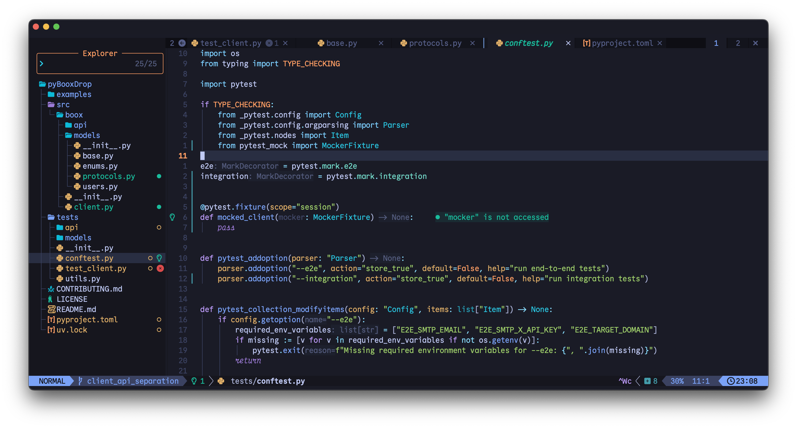

# dotfiles



## Install

1. Sign in to the **Mac App Store**
2. Run the script below

```sh
bin/bash -c "$(curl -fsSL https://raw.githubusercontent.com/filipgodlewski/dotfiles/HEAD/install.sh)"
```

## Uninstall

```sh
cd ~/dotfiles && make -s uninstall
```

## License

MIT – use it, hack it, ship it.
